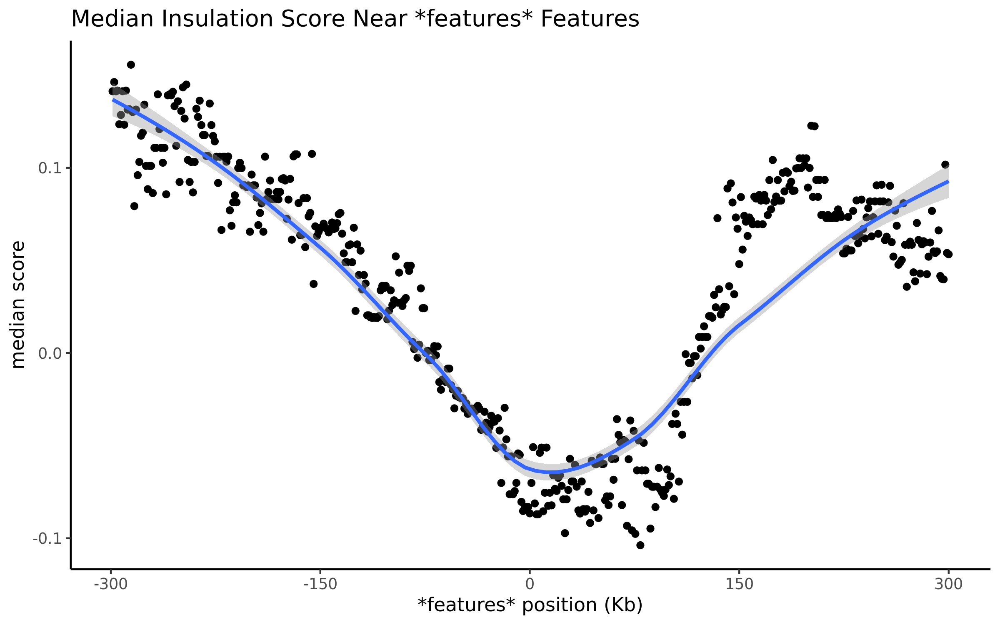

# Pileup insulation

This script is used to pileup the HIC insulation score around a set of features in a bed file. 


## Usage

```
conda env create -f environment.yml -n pileupenv
conda activate pileupenv
```

```
./pileup_insulation.R -i insulation.bed -f features.bed -l featureLabal -s hg38 -o outfile_name.pdf
```

An example pileup of the score over a set of features is shown below:



